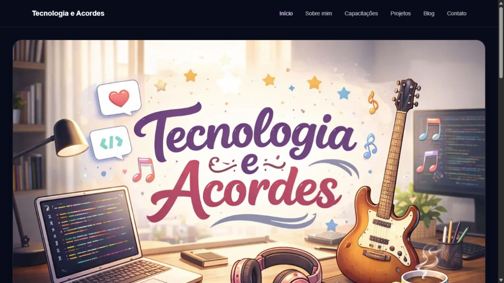
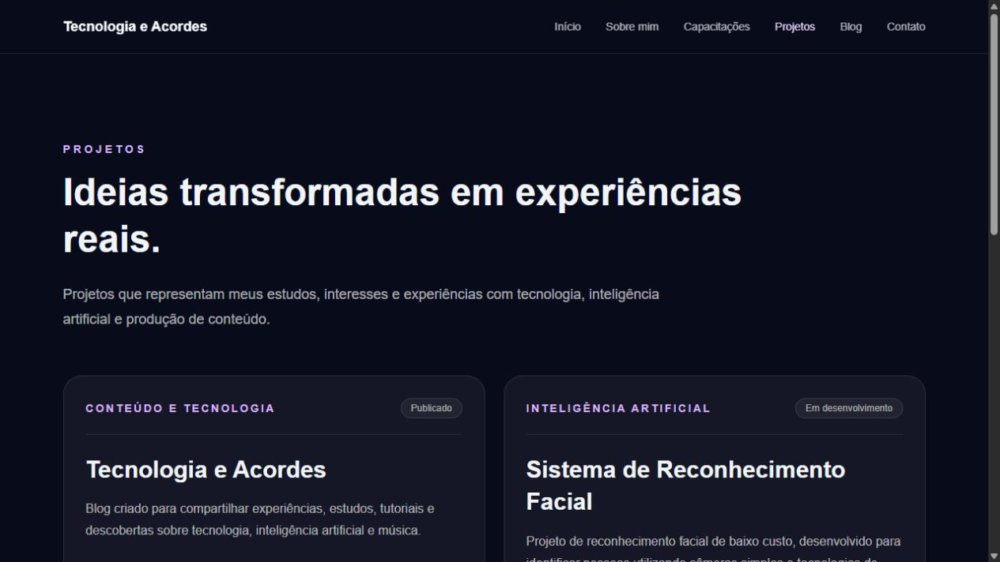

<p align="center">
  <a href="https://www.tecnologiaeacordes.com.br">
    
  </a>
</p>

<h1 align="center">Tecnologia e Acordes</h1>

<p align="center">
  Portfólio, projetos e conteúdos sobre tecnologia, inteligência artificial,
  desenvolvimento de software e música.
</p>

<p align="center">
  <a href="https://www.tecnologiaeacordes.com.br">
    
  </a>
  <a href="https://tecnologiaeacordes.blogspot.com/">
    
  </a>
</p>

<p align="center">
  
  
  
  
  
  
</p>

---

## Sobre o projeto

O **Tecnologia e Acordes** é o portfólio pessoal de **Juliana Cândido**. O
projeto reúne trajetória profissional, formação, capacitações, pesquisas,
projetos e publicações em um espaço que aproxima tecnologia e criatividade.

Além das páginas institucionais, o site consome automaticamente as publicações
do Blogger e gera páginas individuais, metadados e conteúdo otimizado para
buscadores e compartilhamento em redes sociais.

## Visão do projeto

<p align="center">
  
</p>

<p align="center">
  
</p>

### Links rápidos

| Destino | Link |
| --- | --- |
| Site oficial | [tecnologiaeacordes.com.br](https://www.tecnologiaeacordes.com.br) |
| Blog | [tecnologiaeacordes.blogspot.com](https://tecnologiaeacordes.blogspot.com/) |
| Currículo Lattes | [Ver currículo](https://lattes.cnpq.br/3686286770123469) |
| LinkedIn | [Juliana Cândido](https://br.linkedin.com/in/candidojuliana) |
| Instagram | [@tecnologiaeacordes](https://www.instagram.com/tecnologiaeacordes/) |

## Funcionalidades

| Área | Recursos |
| --- | --- |
| Portfólio | Apresentação, trajetória, capacitações, projetos e contato |
| Blog | Integração automática com o Blogger e páginas individuais |
| Segurança | Sanitização do HTML recebido de fontes externas |
| SEO | Metadados por rota, URLs canônicas, Open Graph, sitemap e robots |
| Acessibilidade | Navegação semântica, menu por teclado e link para pular conteúdo |
| Responsividade | Layout adaptado para desktop, tablet e celular |
| Qualidade | TypeScript, ESLint, testes automatizados e build de produção |

## Tecnologias

| Tecnologia | Utilização |
| --- | --- |
| [Next.js](https://nextjs.org/) | App Router, renderização, rotas e metadados |
| [React](https://react.dev/) | Componentes e interações da interface |
| [TypeScript](https://www.typescriptlang.org/) | Tipagem estática e segurança no desenvolvimento |
| [Tailwind CSS](https://tailwindcss.com/) | Estilização e responsividade |
| [Blogger](https://www.blogger.com/) | Origem e gerenciamento das publicações |
| [sanitize-html](https://www.npmjs.com/package/sanitize-html) | Sanitização do conteúdo externo |
| [Vercel](https://vercel.com/) | Hospedagem e deploy contínuo |

## Estrutura do projeto

```text
tecnologia-e-acordes/
├── app/          # Rotas, layout, SEO e metadados
├── components/   # Componentes reutilizáveis da interface
├── lib/          # Integração, sanitização e testes do Blogger
├── public/       # Imagens e outros arquivos estáticos
└── docs/         # Arquitetura, decisões e roadmap
```

## Executando localmente

### Pré-requisitos

- [Node.js](https://nodejs.org/) 20 ou superior
- npm

### Instalação

```bash
git clone https://github.com/j-candido/tecnologia-e-acordes.git
cd tecnologia-e-acordes
npm install
npm run dev
```

Abra [http://localhost:3000](http://localhost:3000) no navegador.

## Comandos disponíveis

| Comando | Finalidade |
| --- | --- |
| `npm run dev` | Inicia o servidor de desenvolvimento |
| `npm run lint` | Analisa a qualidade do código |
| `npm run typecheck` | Verifica os tipos TypeScript |
| `npm run test` | Executa os testes automatizados |
| `npm run check` | Executa lint, TypeScript e testes |
| `npm run build` | Gera e valida o build de produção |
| `npm run start` | Executa o build de produção |

## Documentação

- [Arquitetura do projeto](docs/arquitetura.md)
- [Decisões de arquitetura](docs/decisoes.md)
- [Roadmap](docs/roadmap.md)
- [Especificação do site](docs/site-specification.md)
- [Segurança e privacidade](docs/seguranca-privacidade.md)
- [Histórico de alterações](CHANGELOG.md)
- [Como contribuir](CONTRIBUTING.md)

<details>
  <summary><strong>Próximas evoluções</strong></summary>

  - Galeria de certificados
  - Páginas individuais para projetos
  - Busca no blog
  - Newsletter
  - Painel para atualização de conteúdo
  - Monitoramento de desempenho e erros

</details>

## Contribuições

Sugestões e feedbacks são bem-vindos. Caso encontre um problema ou tenha uma
ideia, abra uma [issue](https://github.com/j-candido/tecnologia-e-acordes/issues).

## Licença

O código-fonte deste projeto está disponível sob a [licença MIT](LICENSE).

Textos autorais, artigos, dados biográficos, currículo, fotografias, nome,
logotipo e identidade visual de **Juliana Cândido** e do **Tecnologia e Acordes**
não fazem parte dessa autorização e permanecem protegidos por direitos autorais.
Consulte o aviso de escopo no próprio arquivo de licença antes de reutilizar o
conteúdo do portfólio.

---

<p align="center">
  Desenvolvido com tecnologia e criatividade por
  <strong>Juliana Cândido</strong>.
</p>
